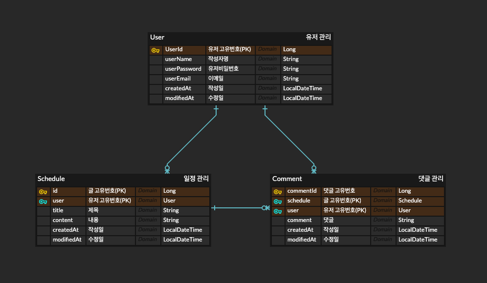

# Schedule

프로젝트 구성

1.프로젝트 개발 환경: 런타임 버전: 21.0.7+9-b895.130 aarch64 (JCEF 122.1.9) VM: JetBrains s.r.o.의 OpenJDK 64-Bit Server VM 
JDK: corretto-17 Amazon Corretto-17.0.15 - aarch64

2. 개발 기간: 2025.08.11 ~ 2025.08.13
3. 날짜별 개발: 11일: lv1 일정 생성, 12일: lv1 일정 조회, lv1 일정 수정, 13일 lv1 일정 삭제, lv2 유저 crud
4. 기능: 1. 일정 CRUD, 유저 CRUD
5. 실행 방법 Java 17이상 설치 필요 Schedule2Application의 main() 실행시 프로그램 시작

# API 명세서
# 일정 관리
| 기능      | method | url                     | 설명        | 응답 코드       | Request                                                                                     | Response                                                                                                                                                         |
|---------|--------|-------------------------|-----------|-------------|---------------------------------------------------------------------------------------------|------------------------------------------------------------------------------------------------------------------------------------------------------------------|
| 일정 생성   | POST   | /schedules              | 일정 생성 | 201 Created | { "name": "JS", "password": "1234", "title": "제목", "contents": "내용" }   | { "id": 1, "name": "JS", "title": "제목", "contents":"내용", "createdAt": "2025-08-01", "modifiedAt": "2025-08-01" }                     |
| 일정 조회 | GET    | /schedules/             | 일정 전부 조회  | 200 OK      |                                                                                             | { "id": 1, "name": "JS", "title": "제목", "contents":"내용", "createdAt": "2025-08-01", "modifiedAt": "2025-08-01" }, {...}, .... |
| 일정 단건 조회 | GET    | /schedules/{id}         | 일정 단건 조회  | 200 OK      |                                                                                             | { "id": 1, "name": "JS", "title": "제목", "contents":"내용", "createdAt": "2025-08-01", "modifiedAt": "2025-08-01" }                     |
| 일정 수정   | PUT    | /schedules/{id}         | 특정 일정 수정  | 200 OK      | { "name": "JS2", "password": "1234", "title": "제목2", "contents": "내용" } | { "id": 1, "name": "JS2", "title": "제목2", "contents":"내용", "createdAt": "2025-08-01", "modifiedAt": "2025-08-02" }                   |
| 일정 삭제   | DELETE | /schedules/{id}         | 특정 일정 삭제  | 200 OK      |                                                                                             | {}                                                                                                                                    |
# 유저 관리
| 기능      | method | url        | 설명                                | 응답 코드  | Request                                                                                                | Response                                                                                                                                                         |
|---------|--------|------------|-----------------------------------|--------|--------------------------------------------------------------------------------------------------------|------------------------------------------------------------------------------------------------------------------------------------------------------------------|
| 유저 생성   | POST   | /user      | 유저 생성                             | 200 OK | { "userName": "JS", "userPassword": "1234", "userEmail": "enmil" } | { "userId": 1, "userName": "JS", "userEmail": "email", "createdAt": "2025-08-01", "modifiedAt": "2025-08-01" }                           |
| 유저 조회 | GET    | /user      | 유저 전부 조회 또는 QueryParam으로 특정 유저 조회 | 200 OK |                                                                                                        | { "id": 1, "name": "JS", "title": "제목", "contents":"내용", "createdAt": "2025-08-01", "modifiedAt": "2025-08-01" }, {...}, .... |
| 유저 수정   | PUT    | /user/{userId} | 특정 유저 수정                          | 200 OK | { "userName": "JS2", "userPassword": "1234", "userEmail": "제목2" }             | { "userId": 1, "userName": "JS2", "userEmail": "email2", "createdAt": "2025-08-01", "modifiedAt": "2025-08-02" }    |
| 유져 삭제   | DELETE | /user/{userId} | 특정 유저 삭제                          | 200 OK |                                                                                                        | {}                                                                                                                                                               |
# 댓글 관리
| 기능       | method | url                                          | 설명       | 응답 코드  | Request                        | Response                                                                                                                                                              |
|----------|--------|----------------------------------------------|----------|--------|--------------------------------|-----------------------------------------------------------------------------------------------------------------------------------------------------------------------|
| 댓글 생성    | POST   | /schedules/{id}/comments                     | 댓글 등록    | 200 OK | { "comment": "댓글내용" }  | { "commentId": 1, "user": "JS", "comment": "댓글 내용", "createdAt": "2025-08-01", "modifiedAt": "2025-08-01" }                                   |
| 댓글 조회    | GET    | /schedules/{id}/comments             | 댓글 전부 조회 | 200 OK |                                | { "commentId": 1, "user": "JS", "comment": "댓글 내용", "createdAt": "2025-08-01", "modifiedAt": "2025-08-01" }, {...}, .... |
| 댓글 단건 조회 | GET    | /schedules/{id}/comments/{commentId} | 댓글 단건 조회 | 200 OK |                                | { "commentId": 1, "user": "JS", "comment": "댓글 내용", "createdAt": "2025-08-01", "modifiedAt": "2025-08-01" }                           |
| 댓글 수정    | PUT    | /schedules/{id}/comments/{commentId} | 특정 댓글 수정 | 200 OK | { "comment": "댓글내용2" } | { "commentId": 1, "user": "JS", "comment": "댓글 내용2", "createdAt": "2025-08-01", "modifiedAt": "2025-08-02" }                               |
| 댓글 삭제    | DELETE | /schedules/{id}/comments/{commentId} | 특정 댓글 삭제 | 200 OK |                                | {}                                                                                                                                                                    |

# ERD

